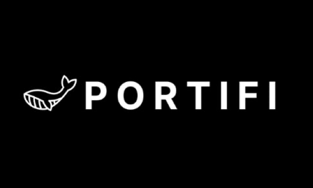
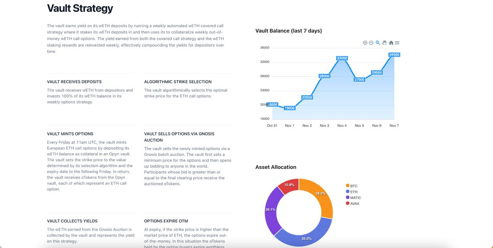
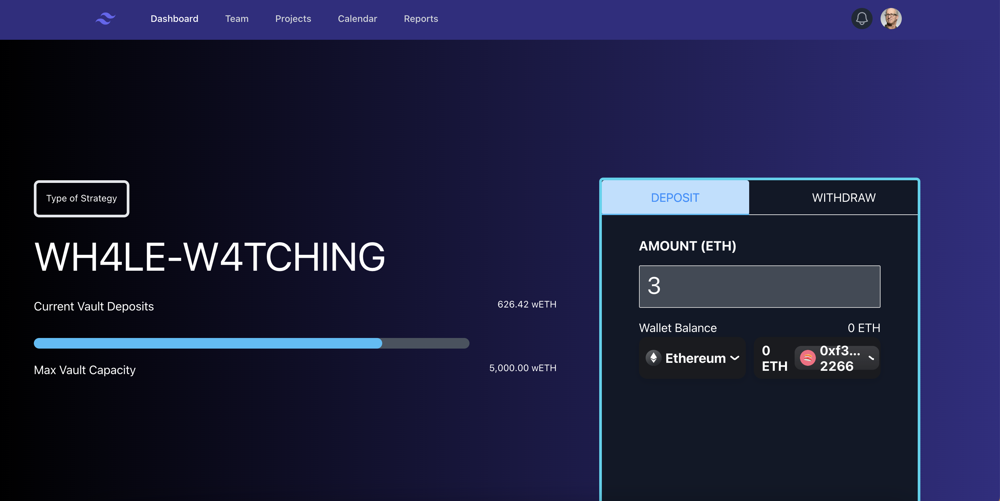

# Portifi-ethsf

## One-liner

Submission for the ethSF hackathon. An active portfolio manager building with vaults following an automated trading strategy.

## Demo

|  |  |
| :----------------------------: | :------------------------------: |
|   |  |

## Project Description

A more permissionless, customizable version of Yearn. Guardians (fund managers) are able to create vaults running arbitrary trading/yield generation strategies and invite users to join those vaults using a whitelist. While the vaults are on-chain, the trading strategies live off-chain and are maintained by the guardians on AWS instances. As such, we are introducing a seamless capital management layer and easy-follow strategy-building template.

As the trading strategy is off-chain, the strategies can be as complicated as the most advanced quantitative strategies employed at hedge funds and trading firms today. We are democratizing access to quant finance for the regular DeFi user, and allowing top traders to raise and manage capital efficiently

## How it's Made

We used the 0x API extensively to execute our trades after the initial amount calculations are discovered. One strategy is the whale watching strategy where we tracked a specific wallet and rebalanced our vault portfolio to match the makeup of that wallet. We run a AWS lambda instance which checks every 5 mins for difference in the portfolio allocations between the whale's address and the vaults allocations and create a pairwise swap data and amount to be swapped to make them identical. We send this encoded data off-chain and after performing computations on the exact target balances of the tokens we want, we called the 0x swap API to fetch quotes and execute the trades. All the other strategies involving swaps are similarly first quoted a price and then perform the filling of the quote.

## Codebase

```
v1-core
|
└── src: all  deployable contracts
|   └── Vault.sol: implementations of ERC4626 compatible vaults
|   └── VaultFactory.sol: factory for creating vaults
|   └── SingleStalkStrategy.sol: basic implementation of watching one target trader by copying their trades off-chain
|   └── SwapToWithdraw.sol: implementation of swapping to withdraw from vaults
|   └── helpers: helper/util contracts
|           └── ZRXHelper.sol: helper abstract contract for doing 0x swaps on-chain
|   └── interfaces: interfaces for external contracts
|           └── IStrategy.sol: interface for strategies
|           └── IVault.sol: interface for vaults
|
└── scripts: scripts for running single, batch swaps off-chain
|   └── singleSwap.js: script for running a single swap with 0x swap API
|   └── batchSwap.js: script for multiple swaps
|   └── NewVault.s.sol: script for creating a new vault

└── tests: forge tests for testing functionality locally
```

## Deployments

Due to the nature of the testing environment for getting accurate live swap data, we can't use the Goerli testnet. That's why you can use the forking script which spins up a local anvil network and forks mainnet.
Find build/testing scripts in the `Makefile`.

## Tech Stack

- Solidity
- Foundry
- AWS lambda
- ethersJS
- ReactJS
- Figma

## Team

- Matthew Krak (Frontend Developer)
- Prathik Malireddy (Fullstack Developer)
- Punn Kamolyabutr (Fullstack Developer)
- Kunal Arora (Fullstack Developer)
